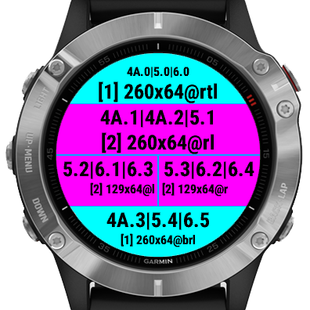
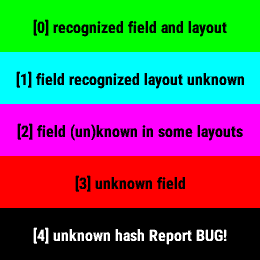
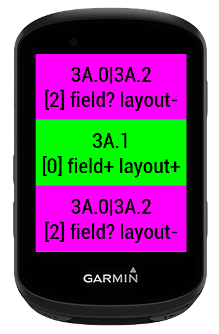

# DF Detector

This datafield is an example for CIQ developers to demonstrate how a datafield can be added multiple times to a layout.

## Description

This datafield is an example for CIQ developers to demonstrate how a datafield can be added to multiple fields in a layout and sometimes be identified. It uses the width, height, obscurityFlags. When you place it to a position that "translates" to a single possibility per layout (3C.2 or 4.2|6.3 or even 5.1|6.1|6.3 on layout 5) then you could use the settings to configure what to display in those "good" positions.

Add this datafield to any activity, multiple times. As you add it to multiple fields (places in the layout) you'll see the detected layout, field position.

If you like the app you can thank me by sending a beer: https://paypal.me/GavrielF or https://buymeacoffee.com/flocsy or at least write a positive review with 5 stars ⭐⭐⭐⭐⭐.

Support Forum: https://forums.garmin.com/developer/connect-iq/f/showcase/359783/datafield-df-detector

## Legend

- [0] | green | field+ layout+ | 3C.2        | exact field and layout detected
- [1] | aqua  | field+ layout- | 4.2|6.3     | field identified inside the layout (it is alone) but could be in multiple layouts
- [2] | pink  | field? layout- | 5.1|6.1|6.3 | in some layout(s) field can be identified (5.1) but in some layout(s) the field is unknown (6.1 or 6.3) (matches multiple fields in the same layout)
- [3] | red   | field- layout? | 6.1|6.2     | unknown field, there are multiple matching fields in each layout
- [4] | black | unknown hash!  | unknown     | unknown field hash (need to add the device or fix the dimensions of the field in the source code)
    NOTE: if you see [4] black background with "unknown" label then please take a screenshot and send it to the Support Forum indicating the device you have.
    Unknown field hash means that there is a bug in the SDK's simulator.json and Garmin need to fix it.

- layout names: 1, 2, 3A, 3B
- field names: layout.position: 1.0, 2.0, 2.1, 3A.2. i.e: 4C.2 means: the 2nd field in the "4 Fields C" layout. Fields are 0 indexed.

'+' means: known, detected, identified (i.e: field+ 1.0 - layout 1, field 0)
'-' means: unknown, can't be distinguished (i.e: layout-: 4.2|6.3 - either layout 4 or 6)
'?' means: depending on the context (field vs layout) can be known or unknown.
        i.e: field? 5.1|6.1|6.3 means in some layouts it's identified (5.1) but in others it can be more than one field (6.1 or 6.3)

obscurity flags: 'b': bottom, 'r': right, 't': top, 'l': left. i.e: 260x129@rtl means the field size is 260x129 and it's obscured on 3 sides: right, top and left

## Screenshots

## Changelog

2.5 (2025-10-15)
    - add edge550, edge850, etrextouch, fenix8pro, gpsmaph1, instinctcrossoveramoled, venu4

2.4 (2025-07-17)
    - add edgemtb, fr570, fr970, venux1

2.3 (2025-04-07)
    - added approachs50, descentg2, instinct3, instincte, vivoactive6

2.2 (2024-08-29)
    - added edge1050,fenix8*,fenixe,enduro3
    - use SDK 7.3.0

2.1 (2024-05-29)
    - fix (Garmin bug) the layouts of some devices
    - use SDK 7.1.1

2.0 (2024-02-21)
    - add "pages" to display more information 
    - add fr165

1.2 (2024-02-08)
    - add rectangle devices

1.1 (2024-02-08)
    - remove field index

1.0 (2024-02-07)
    - initial release
